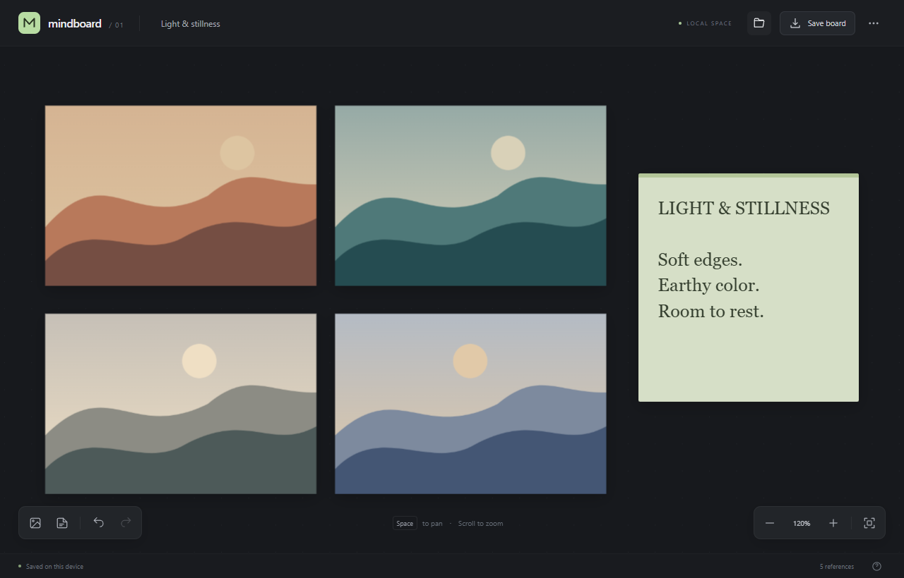
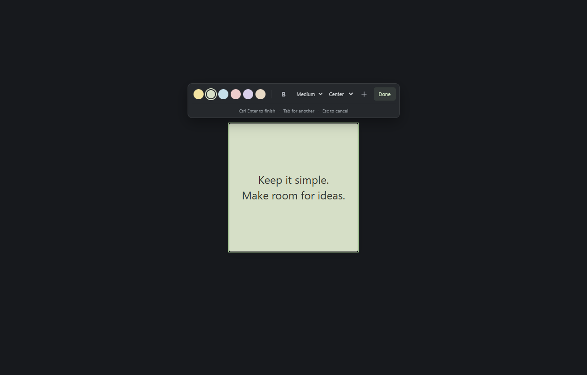

# MindBoard

A quiet place for your references. MindBoard is a minimal, local-first desktop reference board, released under the **MIT license**, including commercial use.

An original application inspired by the reference-board workflow: put images on an infinite canvas, arrange them, and keep your ideas in view. No account, server, telemetry, or network connection is required at runtime.

**[Download MindBoard for Windows](https://github.com/A7E7-Studios/mind-board/releases/latest)** — installer and portable ZIP, with checksums.



[Right-click tools](docs/screenshots/context-menu.png) · [Optional full controls](docs/screenshots/full-controls-board.png)

## Features

- A borderless, plain canvas by default. Right-click for tools; press Tab to reveal the full interface.
- Import multiple PNG, JPEG, WebP, GIF, or AVIF images; drag files onto the canvas or paste clipboard images.
- Pan with Space + drag or the middle mouse button; zoom around the cursor with the wheel.
- Images retain their original pixels when resized. Zoom in to see the detail; double-click an image for a one-to-one pixel view.
- Select, Shift-select, marquee-select, move, proportionally resize, rotate, arrange, duplicate, and reorder references.
- Lock references to prevent accidental edits; write colorful sticky notes directly on the canvas, with text size, alignment, and bold controls.
- Paste text to create a note. Press Tab while editing to add another with the same formatting.
- Leave a note empty to use it as a colored card. Click Done or outside the note to keep it; Escape cancels a new note.
- Undo and redo document edits, including whole pointer gestures.
- Save portable `.mindboard` files with embedded images; reopen them without their original source files.
- Automatic local recovery in IndexedDB after each document edit.
- Optional full controls, fullscreen, and desktop always-on-top mode. Alt-drag moves the desktop window; window controls also live in the right-click menu.
- Keyboard shortcuts, accessible controls, and a compact, responsive interface.



## Updating

To update an installed Windows copy, close MindBoard and run the newer installer from [GitHub Releases](https://github.com/A7E7-Studios/mind-board/releases/latest). It detects the existing installation; a separate manual uninstall is not required. Keep app data if an uninstall step is offered. For a portable copy, close the app and replace its executable with the new download. Existing `.mindboard` files remain compatible. There is no built-in update checker yet.

## Run locally

Requires Node.js 22.12+ (or 24 LTS) and npm. Desktop development also requires Rust and the [Tauri platform prerequisites](https://v2.tauri.app/start/prerequisites/), including the Microsoft C++ build tools and WebView2 on Windows.

```sh
npm ci
npm run desktop:dev
```

For the browser version:

```sh
npm run dev
```

Open `http://127.0.0.1:1420`. Browser saving downloads a file; the desktop app uses native file dialogs. Always-on-top is available only in the desktop app.

## Build

```sh
npm run desktop:build
```

Tauri places the executable and installers in `src-tauri/target/release/`. To build only the standalone executable:

```sh
npm run desktop:build -- --no-bundle
```

The Windows executable uses the system WebView2 runtime. It does not include a browser engine. Release builds enable link-time optimization and strip symbols; the frontend uses vanilla TypeScript with no UI framework or image-processing runtime.

## Testing

```sh
npm run check
npm run test:native
npm run test:desktop
```

`check` runs TypeScript, a production frontend build, model/storage unit tests, and the Playwright browser suite. Playwright uses installed Microsoft Edge by default. Set `PLAYWRIGHT_CHANNEL=chromium` and run `npx playwright install chromium` to use Playwright's Chromium instead.

`test:native` verifies the actual Rust IPC handlers and filesystem operations. `test:desktop` drives the built Windows application through its native WebView with a matching EdgeDriver; see [native test setup](src-tauri/tests/README.md). See [testing and coverage](docs/testing.md) for the complete feature matrix and verification limits.

## Keyboard shortcuts

| Action | Shortcut |
| --- | --- |
| Import images / add note | `I` / `N` |
| Pan | `Space` + drag, or middle drag |
| Zoom / canvas zoom 100% / fit all | Mouse wheel / `1` / `F` |
| View original image pixels | Double-click an image |
| Select all / duplicate | `Ctrl` or `⌘` + `A` / `D` |
| Undo / redo | `Ctrl` or `⌘` + `Z` / `Shift Z` |
| Open / save / new board | `Ctrl` or `⌘` + `O` / `S` / `N` |
| Delete unlocked selection | `Delete` or `Backspace` |
| Show / hide controls | `Tab` while the canvas is focused |
| Tools menu | Right-click or `Shift F10` |
| Move desktop window | `Alt` + drag, or right-click → Move window then drag |
| Close desktop window | Right-click → Close window, or `Ctrl` / `⌘` + `Q` |
| Fullscreen | `F11` |
| Deselect / cancel gesture / close dialog | `Escape` |
| Shortcut help | `?` |

Tab navigates controls normally when a control has focus in the full interface. Text fields keep their editing shortcuts. Double-click a note to edit it. The right-click menu also supports arrow keys, Enter, Space, and Escape. Showing or hiding controls preserves references' positions on screen.

## Files and recovery

Boards use a versioned JSON format containing embedded raster images and geometry. They support up to 2,000 references, 20 MiB per image, and 100 MiB per board file. Individual imported images are limited to 80 megapixels. SVG, remote URLs, executable content, and invalid geometry are rejected.

Recovery keeps the current board on this device; it is not a backup archive. Saving a `.mindboard` file is the way to keep and share a board. New and Open replace the current recovery document; Undo can restore the preceding document in the same session. Clearing application/browser storage removes recovery. Images remain in memory while the board is open, so memory use grows with decoded image dimensions and the number of references.

This first release focuses on image arrangement and notes. It does not yet include cropping, PDF/video import, image export, file associations, or cloud collaboration. Windows is the locally verified desktop platform; other Tauri targets require their own platform verification.

## License

[MIT](LICENSE) © 2026 A7E7 Studios. Image rights remain with their respective owners. Dependency licenses are listed in [third-party notices](THIRD_PARTY_NOTICES.txt); regenerate them with `node scripts/third-party-notices.mjs` after dependency changes.
